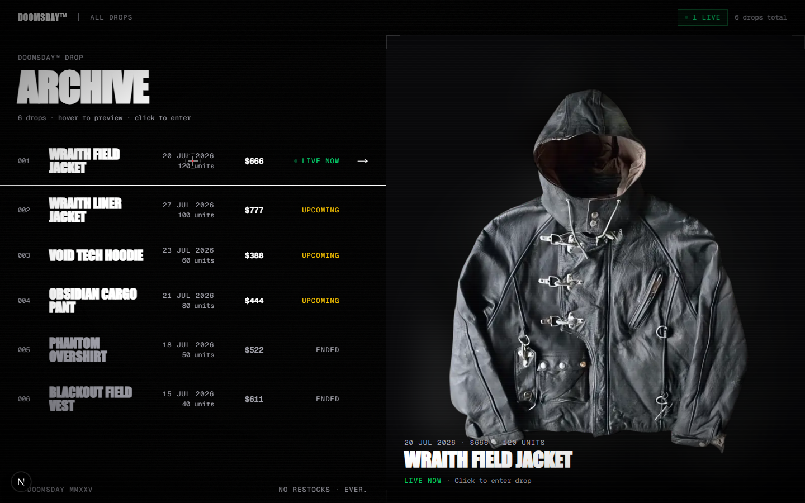
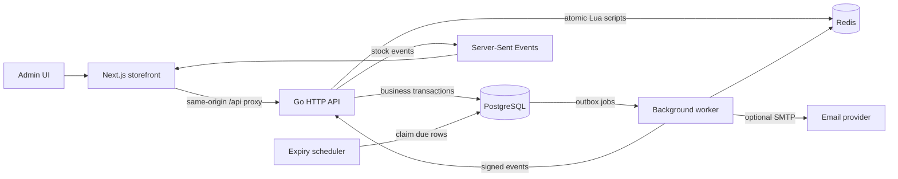
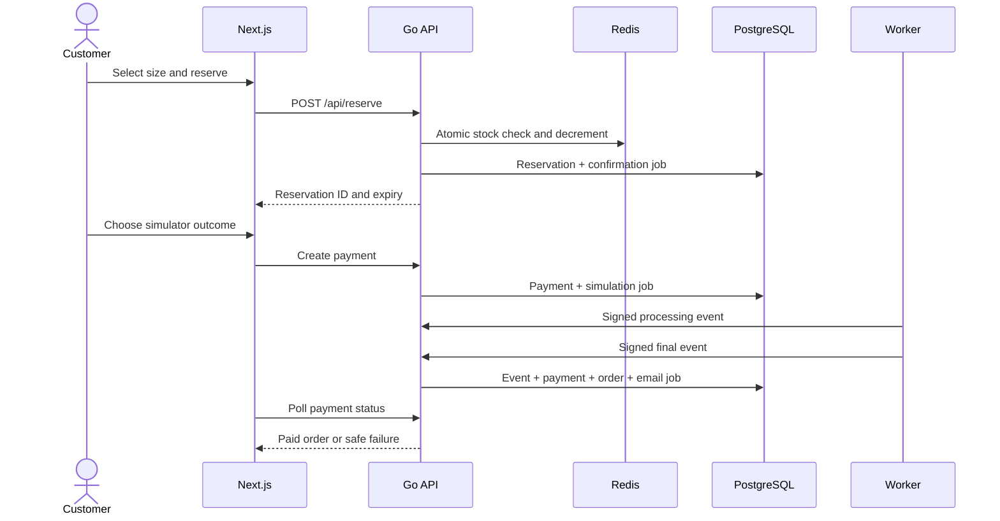
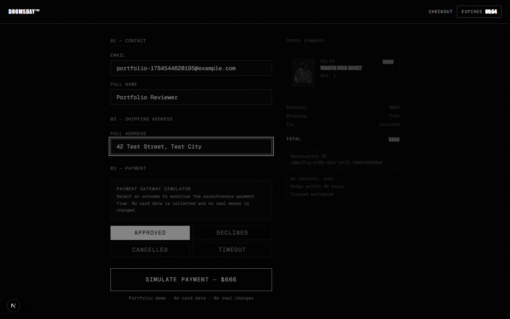

# DOOMSDAY

[](https://github.com/yngnoise/doomsday/actions/workflows/ci.yml)

A production-style limited-release storefront built to explore the hard parts of high-contention commerce: atomic inventory, expiring reservations, asynchronous payments, reliable background work, and real-time stock updates.

> [!IMPORTANT]
> Payments are fully simulated. The application never collects card data, contacts an acquirer, or moves real money.



## Why this project exists

Limited drops create a deceptively difficult systems problem. Many customers can request the final unit at the same time, reservations must expire without restoring stock twice, and payment callbacks can arrive late or more than once. The customer still expects a fast, accessible interface that explains what is happening.

DOOMSDAY is an engineering case study for that problem. It keeps the product scope intentionally small and invests in correctness, failure recovery, test evidence, and a repeatable demo environment.

### Product constraints

- Inventory is finite per size and must never oversell.
- A customer can hold one active reservation per drop for ten minutes.
- Payment success is accepted only from a signed asynchronous event.
- Duplicate requests, webhooks, jobs, and scheduler instances must be safe.
- The public portfolio environment cannot send email or create real charges.
- Core customer journeys must work with keyboard, touch, reduced motion, and mobile layouts.

## What is implemented

- Passwordless OTP authentication with hashed, expiring, single-use codes and rate limits.
- Atomic Redis reservation logic for rate limiting, duplicate prevention, and stock decrement.
- Size-level inventory, reservation countdowns, automatic expiry, and a FIFO waitlist.
- Server-Sent Events for live stock changes.
- A payment gateway adapter with approved, declined, cancelled, timeout, and refund scenarios.
- HMAC-signed, idempotent payment webhooks that create at most one order.
- A PostgreSQL transactional outbox with leases, exponential retry, dead-letter handling, and stable idempotency keys.
- Reservation and order emails through SMTP outside demo mode.
- An admin workspace for drops, inventory, orders, payments, and refunds.
- Responsive, WCAG-oriented customer flows with automated axe checks.
- Docker images, a four-service Compose demo, and a Render Blueprint.
- Unit, integration, security, accessibility, and full-browser CI coverage.

## Architecture



The API is horizontally safe at the critical boundaries. Redis performs the hot-path inventory mutation atomically. PostgreSQL remains the durable source for users, reservations, payments, orders, payment events, and outbox jobs. Background workers use `FOR UPDATE SKIP LOCKED`, so multiple instances can consume jobs without serializing the whole queue.

### Reservation and payment flow



Payment events have deterministic IDs, webhook inserts are conflict-safe, and the order references a unique payment. A successful event, its order, and its confirmation job commit together. See [the outbox design](docs/outbox.md) for the at-least-once delivery model and operational queries.

## Correctness and evidence

| Claim | Mechanism | Evidence |
| --- | --- | --- |
| The last unit cannot be sold twice | One Redis Lua operation checks limits and decrements size plus total stock | [Redis tests](drop/reservation_redis_test.go), [concurrency integration test](drop/integration_test.go) |
| Duplicate payment delivery creates one order | Unique event IDs, row locks, unique payment/order constraints | [Payment tests](drop/payment_test.go), [integration test](drop/integration_test.go) |
| Jobs survive API restarts | Business state and outbox job share a PostgreSQL transaction | [Outbox integration tests](drop/outbox_integration_test.go) |
| Worker crashes and transient failures recover | Processing leases, exponential backoff, eight-attempt dead letter | [Outbox tests](drop/outbox_test.go), [recovery tests](drop/outbox_integration_test.go) |
| Multiple schedulers restore stock once | `SKIP LOCKED`, an `expiring` state, and idempotent Redis release | [Scheduler integration test](drop/integration_test.go) |
| Critical customer paths work end to end | Real Go, PostgreSQL, Redis, Next.js, and Chromium in CI | [Playwright journeys](e2e/critical-journeys.spec.ts), [CI workflow](.github/workflows/ci.yml) |
| Core pages meet the automated accessibility baseline | Desktop and Pixel 5 axe scans, keyboard and focus assertions | [Accessibility tests](e2e/accessibility.spec.ts), [audit notes](docs/accessibility.md) |
| Requests and durable jobs remain diagnosable without leaking customer data | JSON logs, correlation IDs, bounded Prometheus labels, OpenTelemetry context in the outbox | [Observability tests](drop/observability_test.go), [operations guide](docs/observability.md) |
| Concurrency and recovery claims are repeatable | k6 contention/checkout/SSE workloads, Toxiproxy dependency failures, PostgreSQL/Redis invariant checks | [Load-testing guide](docs/load-testing.md), [CI workflow](.github/workflows/ci.yml) |

The current Lighthouse baseline is Accessibility 100, Best Practices 100, SEO 100, median Performance 89, CLS 0, and median LCP 2.12 seconds on a local production build. Measurement details and reproduction steps are in [docs/accessibility.md](docs/accessibility.md); image, decode, and GPU budgets are documented in [docs/performance.md](docs/performance.md).

## Technology

| Layer | Stack |
| --- | --- |
| Web | Next.js 16, React 19, TypeScript, Tailwind CSS, Framer Motion |
| API | Go 1.25, `net/http`, pgx, OpenTelemetry, Prometheus |
| Data | PostgreSQL 16, Redis 7 |
| Authentication | Email OTP, HMAC hashing, JWT |
| Async work | PostgreSQL transactional outbox |
| Testing | Go test, Playwright, axe-core, k6, Toxiproxy |
| Delivery | Docker, Docker Compose, Render Blueprint, GitHub Actions |

## Try the safe demo

The stable hosted URL is tracked in [issue #19](https://github.com/yngnoise/doomsday/issues/19). Until it is published, the complete portfolio environment runs locally with Docker Compose.

Requirements: Docker Engine with Compose v2.

```bash
cp .env.example .env
```

Replace `JWT_SECRET`, `PAYMENT_WEBHOOK_SECRET`, and `ADMIN_PASSWORD` with unique values, or generate local values on Windows:

```powershell
powershell -ExecutionPolicy Bypass -File scripts/rotate-local-secrets.ps1
```

Start the four-service stack:

```bash
docker compose -f compose.demo.yml up --build -d
docker compose -f compose.demo.yml ps
```

Open [http://localhost:3000](http://localhost:3000). The demo intentionally displays its OTP, disables SMTP, resets disposable data when the API starts, and labels every payment outcome as a simulation.

### Five-minute walkthrough

1. Open the live drop and sign in with any email-shaped value.
2. Use the displayed demo OTP to authenticate.
3. Select a size and reserve one unit; observe the ten-minute hold.
4. Continue to checkout and try a declined or timeout outcome.
5. Retry with `Approved` and inspect the confirmation page.
6. Open `/admin`, sign in with `ADMIN_PASSWORD`, inspect the order, and issue a simulated refund.
7. Join a sold-out drop's waitlist or let a reservation expire to see stock return.



Deployment, reset, health-check, and rollback instructions are in [docs/deployment.md](docs/deployment.md).

## Local development

Requirements: Go 1.25+, Node.js 22+, PostgreSQL 16, and Redis 7.

```bash
cp .env.example .env
npm ci
createdb doomsday
psql -d doomsday -f migrations/migrate.sql
psql -d doomsday -f seed_drops.sql
```

Update `DATABASE_URL` and the application secrets in `.env` before starting the API. If the database already exists, skip `createdb`.

Run the API and web application in separate terminals:

```bash
go run .
```

```bash
npm run dev
```

The storefront is available at `http://localhost:3000`; the API listens on `http://localhost:8080`. SMTP is optional in demo and test environments. When it is omitted, delivery is skipped and the OTP is never written to logs; demo/test codes are supplied through their explicit environment variables.

Operational endpoints are exposed at `/health/live`, `/health/ready`, `/health/dependencies`, and `/metrics`. JSON log fields, metric names, trace export, and privacy rules are documented in [docs/observability.md](docs/observability.md).

## Verification

```bash
# Unit and static checks
go test ./...
go vet ./...

# Production frontend build
npm run build

# Browser dependencies and full journeys
npx playwright install chromium
npm run test:e2e

# Accessibility-focused subset
npm run test:a11y

# Disposable k6, failure-injection, and invariant suite
sh scripts/run-load-tests.sh
```

The PostgreSQL/Redis integration suite uses the `integration` build tag and the `TEST_DATABASE_URL` plus `TEST_REDIS_ADDR` environment variables:

```bash
go test -tags=integration ./drop -count=1
```

CI runs Go tests, vet, vulnerability scanning, frontend build, dependency audit, integration tests, and 12 desktop/mobile browser scenarios. Failed Playwright runs retain traces and screenshots.

## Design decisions and trade-offs

- **Redis for contention:** atomic Lua keeps the reservation path fast and prevents overselling, but Redis and PostgreSQL cannot share one transaction. Idempotent compensation and startup reconstruction handle that boundary.
- **PostgreSQL instead of a message broker:** the outbox gives durable at-least-once work without adding Kafka or RabbitMQ to an MVP. It is simpler operationally but requires retention and queue-health monitoring.
- **Polling after payment creation:** the simulator behaves like an external provider and the browser polls payment status. WebSocket payment updates would improve latency but add another stateful channel.
- **Email at least once:** retries reuse a stable `Message-ID`; an SMTP provider can still deliver a duplicate if the worker crashes after send and before acknowledgement.
- **Same-origin API proxy:** browser traffic goes through Next.js, simplifying CORS and deployment. It adds one network hop and couples the web deployment to API routing.

## Security and demo boundaries

- Production-like environments reject weak JWT, webhook, and admin secrets.
- OTP values are hashed in PostgreSQL, expire after ten minutes, and are single-use.
- Webhook signatures use HMAC-SHA256 and constant-time comparison.
- Checkout never accepts card numbers or payment tokens.
- Demo mode disables SMTP and refuses destructive reset behavior unless explicitly enabled.
- Credentials belong in environment variables and are excluded from version control.
- Structured telemetry excludes OTP codes, credentials, authorization values, email addresses, user IDs, customer names, and shipping addresses.

This is a portfolio system, not a PCI-compliant commerce platform.

## Known limitations

- There is no real acquirer, tax calculation, shipping integration, fulfillment, returns, or customer support workflow.
- The public Render URL is not yet published; free-tier PostgreSQL and web services are not durable production infrastructure.
- Admin and live-drop operational UX is still being expanded in [issue #25](https://github.com/yngnoise/doomsday/issues/25).
- Automated accessibility checks do not replace manual screen-reader, zoom, and assistive-technology testing.

## Repository map

```text
app/                 Next.js pages and the web health route
components/          Shared interactive UI
drop/                Go domain, HTTP, payment, scheduler, and worker code
migrations/          Idempotent PostgreSQL migrations
e2e/                 Critical journey and accessibility tests
deploy/              Production API and web Dockerfiles
docs/                Deployment, accessibility, and outbox notes
scripts/             Local maintenance and screenshot tooling
```

Progress is tracked in [ROADMAP.md](ROADMAP.md) and umbrella [issue #27](https://github.com/yngnoise/doomsday/issues/27).

Built by [@yngnoise](https://github.com/yngnoise).
